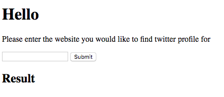

# Web Server

This is a simple web server in which you can specify a URL web link and it will return a Twitter profile if found on the webpage. Please note that this server only looks at the current page of the link provided and not the entire domain e.g. `http://ashwinkachhara.com/contact-3/` will return a Twitter profile link however `http://ashwinkachhara.com/` will not.

This server uses **Sinatra** which is a simple web server gem for Ruby. It also uses the **Nokogiri** gem which can parse HTML and search through it using (in this project's case) CSS selectors.

##Dependencies / Requirements

* Bundler 1.13.6 (latest)
* Ruby 2.3.0

##How to use?

1. Clone this repository to your local machine (I usually do this to desktop for easier navigation):
2. CD into the cloned repository and run:
    `bundle install`
    --> *This so that you have all the gems / dependencies installed on your particular project.*
3. Then run the following command to get the app running:
    `ruby app.rb`
4. Go to your browser and type the below onto your URL search bar:
    `http://localhost:4567/getlinks`
5. You should see the following on your browser:
  
6. Type in a URL of your choice into the form and hit submit.
7. If a Twitter profile is found, this will show up under **Results** heading.
8. To exit the web server, type `CTRL + C` on your command line.

